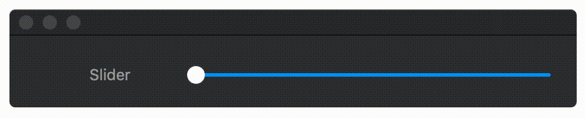
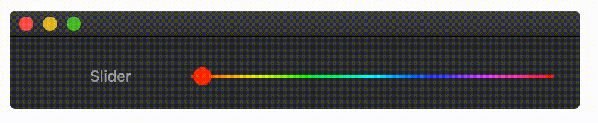

# JCGGColorSlider  [](http://perso.crans.org/besson/LICENSE.html)
> A colorful subclass of NSSlider.

An NSSlider subclass. Supports colored sliders, including gradients. Can match knob color to that of location on the slider.




## Installation
Clone the source and copy `JCGGColorSlider.swift` to your project.

## Use
Simply assign an NSSlider to subclass `JCGGColorSlider`. Slider can be configured with the following options:

* barColor - The color of the `NSSlider` bar
* barGradient - Overrides `barColor`, assign a gradient to the slider
* knobColor - Color of the knob
* knobColorFromLocation - overrides `knobColor`, setting the knob's color to that of it's location on the slider bar
* bezelMargin - effects the thickness of the slider bar

### Example - Rainbow gradient


1. Create an NSSlider and assign its subclass to `JCGGColorSlider`
2. Create a rainbow gradient
3. Assign gradient to NSSlider
4. Set knob to match color

```
// 1
let exampleSlider = JCGGSlider.init(frame: example)

// 2
let rainbow = NSGradient.init(colors: Array(0...10).map{ NSColor.init(calibratedHue: CGFloat($0) / 10, saturation: 1.0, brightness: 1.0, alpha: 1.0) })!

// 3
exampleSlider.barGradient = rainbow

// 4
exampleSlider.knobColorFromLocation = true
```

## License
`JCGGColorSlider` is available under the MIT license. See the LICENSE file for more details.